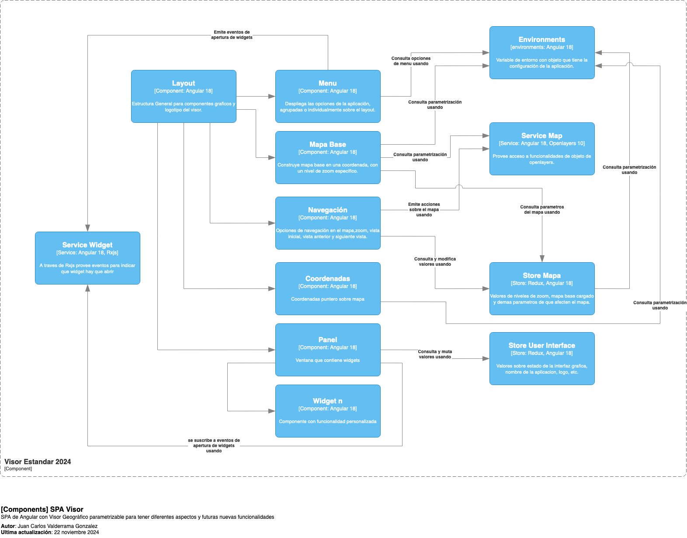

<p> 
    <h1 align="center"> 
        Visor Geográfico Estandar 2024
    </h1>
</p>
<p align="center">


</p>

Proyecto con visor geografico estandar, se encuentra elaborado con [Angular CLI](https://github.com/angular/angular-cli) version 18.2.12 y [Prime NG](https://primeng.org/) de framework. adicionalmente [NGRX](https://ngrx.io/) como librería para la gestion del estado global.

## Tabla de Contenidos

- [Requisitos Previos](#requisitos-previos)
- [Instalación](#instalación)
- [Comandos Básicos](#comandos-básicos)
- [Manejo de Variables de Entorno](#manejo-de-variables-de-entorno)
- [Estructura del Proyecto](#estructura-del-proyecto)
- [Diagrama](#diagrama)

Para este proyecto necesitamos conocimientos basicos en:

- Programación HTML
- [SCSS](https://www.w3.org/Style/CSS/)
- [JavaScript](https://www.javascript.com/learn)
- [Angular 18](https://angular.io/docs)
- [Prime NG](https://primeng.org/)
- [TypeScript](https://www.typescriptlang.org/)

## Instalacion

Para la instalacion de nuestro proyecto necesitaremos realizar las siguientes instalaciones:

1. Instalar paquetes de Node.js y sus dependencias

```bash
npm install
```

2.  Instalar de forma global la interfaz de línea de comandos (CLI) de Angular:

```bash
npm install -g @angular/cli
```

3. Iniciar nuestro proyecto:

```bash
ng s
```

## Comandos Básicos

A continuación se muestran algunos de los comandos más comunes para trabajar con este proyecto:

- **Crear componentes**
  ```bash
  ng generate component component-name //
  ng g c component-name
  ```
- **Crear servicios**

  ```bash
  ng generate service nombre-del-servicio //
  ng g s nombre-del-servicio
  ```

- **Verificación de estilos de codigo**
  ```bash
  ng lint
  ```
- **Pruebas unitarias**
  ```bash
  ng test
  ```

## Manejo de Variables de Entorno

Para garantizar que la aplicación utilice la configuración correcta para cada entorno (desarrollo, producción, etc.), es fundamental seguir una convención estricta al importar las variables de entorno. + +Importar siempre desde la ruta de alias genérica: 

```typescript 
import { environment } from 'environments/environment'; 
```
Nunca importar desde un archivo específico de entorno: 

```typescript  
// ¡INCORRECTO! 
import { environment } from 'environments/environment.development'; 
```
### ¿Por qué es importante? 
El archivo angular.json está configurado para que, durante el proceso de compilación (ng build o ng serve), el Angular CLI reemplace automáticamente el archivo base environment.ts por el archivo correspondiente al entorno que se está construyendo. 

Para proyectos específicos (como opiac), el archivo tsconfig.opiac.json utiliza un alias de ruta (paths) para redirigir la importación genérica al directorio de entornos de ese proyecto. De esta manera, el código fuente compartido puede usar la misma ruta de importación sin cambios, y el compilador se encarga de resolverla al archivo correcto según el proyecto que se esté construyendo. 

Si se importa directamente un archivo específico, este mecanismo de reemplazo y redirección se ignora, lo que provocará que la aplicación se ejecute con variables de entorno incorrectas.


## Entorno de desarrollo con Docker
Para configurar el entorno de desarrollo utilizando Docker, sigue los siguientes pasos:

1. Asegúrate de tener Docker y Docker Compose instalados en tu máquina. Puedes descargar Docker desde [aquí](https://www.docker.com/products/docker-desktop).

2. En el directorio raíz del proyecto, ejecuta el siguiente comando para construir y levantar los contenedores necesarios para el entorno de desarrollo:

```bash
docker-compose -f docker-compose.dev.yml up --build
```

Este comando utilizará el archivo `docker-compose.dev.yml` para definir los servicios necesarios y construir las imágenes Docker. Una vez que los contenedores estén en funcionamiento, podrás acceder a la aplicación en tu navegador web en la dirección especificada (por defecto suele ser `http://localhost:4200`).

3. Para detener los contenedores, puedes usar el siguiente comando:

```bash
docker-compose -f docker-compose.dev.yml down
```

Esto detendrá y eliminará los contenedores creados para el entorno de desarrollo.

Utilizar Docker para el desarrollo permite aislar las dependencias y configuraciones del proyecto, asegurando que todos los miembros del equipo trabajen en un entorno consistente.

## Estructura del proyecto

En este proyecto manejaremos una estructura por componentes **STANDALONE** los cuales estaran organizados en las diferentes carpetas del proyecto, de la siguiente forma:

```bash

src/
│── app/                          # Componentes principales de la app
│   ├── core/                     # Módulos transversales de la aplicación
│   │   ├── components/           
│   │   ├── interfaces/       
│   │   ├── pages/             
│   │   ├── services/           
│   │   ├── store/                # Estado global manejado con NgRx
│   │   ├── utils/              
│   │   └── widget/             
│   │
│   ├── shared/                   # Componentes compartidos que se pueden reutilizar en core o widgets
│   │   ├── components/         
│   │   ├── interfaces/         
│   │   ├── services/           
│   │   └── utils/              
│   │
│   ├── widget/                   # Componentes agrupados por Widget
│   │   ├── widget1/              # Componentes del Widget 1
│   │   │   ├── components/
│   │   │   ├── services/
│   │   │   ├── store/
│   │   │   └── interfaces/
│   │   │
│   │   └── widget2/              # Componentes del Widget 2
│   │       ├── components/
│   │       ├── services/
│   │       ├── store/
│   │       └── interfaces/
│   │
│   └── widget-ui/                # Widgets de interfaz de usuario
│
│── assets/                       # Recursos globales compartidos
│   └── images/                   # Iconos e imágenes generales
│── projects/                     # Proyectos/clientes específicos
│   └── cliente-a/                # Proyecto cliente-a
│       ├── assets/               # Recursos exclusivos del cliente
│       ├── components/           # Componentes propios del proyecto
│       ├── files/                # Archivos adicionales de configuración
│       ├── pages/                # Páginas del proyecto
│       ├── patrones/             # Patrones de diseño específicos
│       ├── public/               # Recursos estáticos públicos
│       ├── widget/               # Widgets exclusivos del proyecto
│       ├── environments/         # Configuración de entornos del proyecto
│       └── styles/               # Widgets exclusivos del proyecto
│       ├── index.html            # Entry point del cliente
│       ├── main.ts               # Bootstrap de Angular
│       ├── styles.scss           # Estilos exclusivos
│       ├── cliente-a.config.ts   # Configuración específica
│       └── cliente-a.routes.ts   # Rutas del proyecto
│
│── environments/                 # Configuración de entornos proyecto principal
│   ├── environment.ts
│   └── environment.prod.ts
│
├── angular.json                  # Configuración de proyectos Angular
├── tsconfig.json                 # Configuración base de TypeScript
├── tsconfig.app.json             # Configuración para app genérica
├── tsconfig.cliente-a.json       # Configuración para cliente-a
└── README.md                     # Documentación principal
```
## Agregar un nuevo proyecto (cliente)

Este repositorio permite manejar múltiples aplicaciones Angular en paralelo.
Cada aplicación se define en el angular.json y mantiene sus propios archivos de configuración, estilos y assets.

### Pasos para crear un nuevo proyecto

1. Crear carpeta del proyecto
Ubícate en la ruta:

```bash
src/projects/<nombre-proyecto>/
```

Allí se debe crear al menos un main.ts y la estructura mínima para que la app pueda arrancar.

Ejemplo:

```bash
src/projects/<nombre-proyecto>/main.ts
src/projects/<nombre-proyecto>/index.html
```

2. Crear archivo de configuración TypeScript
En la raíz del proyecto, se debe crear un tsconfig.nombre-proyecto.json.
Ejemplo:

```bash
{
  "extends": "./tsconfig.json",
  "compilerOptions": {
    "outDir": "./out-tsc/<nombre-proyecto>",
    "types": [],
    "paths": {
      "@app/*": [
        "app/*"
      ],
      "@projects/*": [
        "projects/*"
      ],
      "src/environments/environment": [
        "src/projects/<nombre-proyecto>/environments/environment"
      ]
    }
  },
  "files": ["src/projects/<nombre-proyecto>/main.ts"],
  "include": ["src/**/*.d.ts"]
}
```


⚠️ Importante: estos tsconfig.*.json deben quedar en la raíz del proyecto, no dentro de src/.

3. Registrar el proyecto en angular.json
Dentro de la sección "projects", agregar una nueva entrada.

Debe considerar remplazar las variables de entorno generales; por defecto Angular usará la variable de entorno localizada en src/environments/environment.ts sin importar el entorno. Para ello debe adicionar a la configuracion de cada entorno la propiedad fileReplacements con el remplazo respectivo.


Ejemplo:

```bash
    "<nombre-proyecto>": {
      "projectType": "application",
      "root": "src/projects/<nombre-proyecto>",
      "sourceRoot": "src",
      "prefix": "<nombre-proyecto>",
      "architect": {
        "build": {
          "builder": "@angular-devkit/build-angular:application",
          "options": {
            "outputPath": "dist/<nombre-proyecto>",
            "index": "src/projects/<nombre-proyecto>/index.html",
            "browser": "src/projects/<nombre-proyecto>/main.ts",
            "polyfills": [
              "zone.js"
            ],
            "tsConfig": "tsconfig.<nombre-proyecto>.json",
            "inlineStyleLanguage": "scss",
            "assets": [
              "src/favicon.ico",
              "src/projects/<nombre-proyecto>/assets",
              "src/assets",
              {
                "glob": "**/*",
                "input": "src/projects/<nombre-proyecto>/public",
                "output": "/"
              }
            ],
            "styles": [
              "src/projects/<nombre-proyecto>/styles.scss",
              "node_modules/ol/ol.css",
              "node_modules/ngx-guided-tour/scss/guided-tour-base-theme.scss"
            ],
            "scripts": []
          },
          "configurations": {
            "production": {
              "outputHashing": "all",
              "fileReplacements": [
                {
                  "replace": "src/environments/environment.ts",
                  "with": "src/projects/<nombre-proyecto>/environments/environment.ts"
                }
              ]
            },
            "development": {
              "optimization": false,
              "extractLicenses": false,
              "sourceMap": true,
              "fileReplacements": [
                {
                  "replace": "src/environments/environment.ts",
                  "with": "src/projects/<nombre-proyecto>/environments/environment.development.ts"
                }
              ]
            }
          },
          "defaultConfiguration": "production"
        },
        "serve": {
          "builder": "@angular-devkit/build-angular:dev-server",
          "options": {
            "host": "0.0.0.0"
          },
          "configurations": {
            "production": {
              "buildTarget": "<nombre-proyecto>:build:production"
            },
            "development": {
              "buildTarget": "<nombre-proyecto>:build:development"
            }
          },
          "defaultConfiguration": "development"
        },
        "extract-i18n": {
          "builder": "@angular-devkit/build-angular:extract-i18n"
        },
        "test": {
          "builder": "@angular-devkit/build-angular:karma",
          "options": {
            "polyfills": [
              "zone.js",
              "zone.js/testing"
            ],
            "tsConfig": "tsconfig.spec.json",
            "inlineStyleLanguage": "scss",
            "assets": [
              "src/favicon.ico",
              "src/assets",
              {
                "glob": "**/*",
                "input": "src/projects/<nombre-proyecto>/assets",
                "output": "assets/<nombre-proyecto>"
              }
            ],
            "styles": [
              "src/styles.scss",
              "node_modules/ol/ol.css"
            ],
            "scripts": []
          }
        },
        "lint": {
          "builder": "@angular-eslint/builder:lint",
          "options": {
            "lintFilePatterns": [
              "src/**/*.ts",
              "src/**/*.html"
            ]
          }
        }
      }
    }
```


4. Levantar el proyecto
Para ejecutar una app específica:

```bash
ng serve <nombre-proyecto>
```

Para compilar en modo producción:

```bash
ng build <nombre-proyecto> --configuration production
```

## Concepto de Widget
Componente descentralizado que tiene sus propios componentes, servicios, store y interfaces. Los widgets se pueden reutilizar en diferentes aplicaciones y se pueden agregar o quitar fácilmente de la aplicación principal, sin afectar a otros widgets.

Es importante tener el contexto general del proyecto para evitar la duplicación de funcionalidades y mantener la coherencia en la aplicación.

Para ser usados en la interfaz grafica de la aplicación, los widgets deben ser registrados en el servicio `UserInterfaceService`. Para más información, consulta la
[Documentación del Servicio de Interfaz de Usuario](src/app/core/services/user-interface-service/README.md)

## Diagrama de componentes - Modelo C4

Visor Estándar 2024 es una aplicación desarrollada en Angular 18 para la visualización y manipulación de mapas geográficos. Este proyecto sigue un modelo parametrizable, permitiendo incorporar diferentes funcionalidades y aspectos según las necesidades del usuario. El diseño modular de la aplicación se propone dividiendo los componentes y servicios en bloques funcionales bien definidos para facilitar la escalabilidad y el mantenimiento, diseño que se representa en el siguiente diagrama:




## Administrador de estados de la aplicación

[NGRX](https://ngrx.io/) es el administrador del estado de la aplicación. Este nos permite tener múltiples almacenes de datos o estados en nuestra aplicación, lo que brinda una mayor flexibilidad y control sobre cómo se manejan y comparten los datos entre los diferentes componentes.

## Convenciones de codificación

En este proyecto manejaremos la convención de documentación de código inline, [JSDoc](https://jsdoc.app/).

## Uso de librerias auxiliares

Con el fin de facilitar el desarrollo del proyecto y el diseño responsivo se ha definido la utilización de la libreria PRIMEFLEX que proporciona clases auxiliares para el manejo de estilos css: grilas, flexbox, sombras, entre otros. Para más detalle, consultar [PrimeFlex](https://primeflex.org/)


## Temas globales por cliente
En la ruta src/assets/themes/ se encuentra la carpeta que centraliza los temas globales personalizados por cliente, cada uno organizado en su propia subcarpeta. Para mas detalles revise el [README de temas](src/assets/themes/README.md)

## Despliegue para Producción con Docker

Para el despliegue de la aplicación en un entorno de producción utilizando Docker, se utiliza el archivo `docker-compose.yml`. Este despliegue requiere la configuración de variables de entorno para la base de datos, los certificados SSL y la persistencia de datos.

1.  **Crear archivo de entorno**

    Crea un archivo llamado `.env` en el directorio raíz del proyecto. Este archivo contendrá las variables de entorno necesarias.

2.  **Configurar variables de entorno**

    Añade las siguientes variables al archivo `.env`. Asegúrate de reemplazar los valores de ejemplo con las rutas y credenciales correctas para tu entorno.

    ```bash
    # Rutas absolutas a los volúmenes de certificados SSL
    SSL_KEY_VOLUME=
    SSL_CERT_VOLUME=
    # Ruta absoluta para el volumen de persistencia de datos de PostgreSQL
    POSTGRES_VOLUME=
    # Credenciales para la base de datos PostgreSQL
    DB_USER=
    DB_PASSWORD=
    DB_NAME=
    # Ruta absoluta al volúmen del geoserver
    GEOSERVER_VOLUME=ruta_a_carpeta_de_host_para_datos_geoserver
    ```

3.  **Levantar los servicios**

    Con el archivo `.env` configurado, ejecuta el siguiente comando para construir y levantar los contenedores en modo _detached_:

    ```bash
    docker-compose up -d --build
    ```

4.  **Detener los servicios**

    Para detener y eliminar los contenedores, utiliza:

    ```bash
    docker-compose down
    ```
